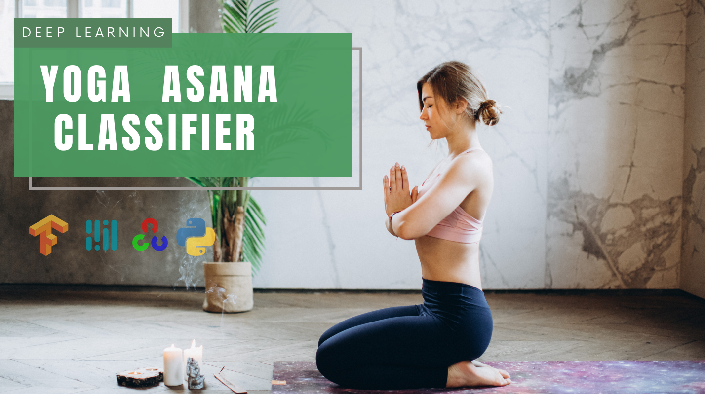

# Yoga Asana Classifier



## Description
Welcome to the Yoga Asana Classifier project. This project uses deep learning to predict the yoga pose you are performing in front of the webcam. It consists of three Python scripts: `data_collection.py`, `data_training.py`, and `inference.py`.

The `data_collection.py` script is used to collect training data. It uses the Mediapipe pose detection library to detect the human body pose and saves the pose data for each frame to a .npy file.

The `data_training.py` script is used to train a Dense neural network model on the collected data. The model is implemented using Keras.

The `inference.py` script is used to make predictions on live webcam feed. It uses the trained model to predict the yoga pose being performed.

## Requirements
- mediapipe
- keras
- tensorflow
- opencv-python
- numpy

## How to Run?

### Data Collection
To collect data for a new yoga pose, run the `data_collection.py` script and provide the name of the yoga pose when prompted. The script will open a webcam feed and start collecting pose data. Make sure to perform the yoga pose in front of the webcam. The data will be saved to a .npy file in the current directory.

```bash
python data_collection.py
```

### Training
To train the model on the collected data, run the `data_training.py` script. The script will load the data from the .npy files in the current directory, train the model on the data, and save the trained model to a .h5 file.

```bash
python data_training.py
```

### Inference
To make predictions on live webcam feed, run the `inference.py` script. The script will open a webcam feed and start making predictions on the yoga pose being performed. The predicted pose will be displayed on the webcam feed.

```bash
python inference.py
```

## Contributing
If you would like to contribute to this project, please feel free to fork the repository, make your changes, and open a pull request. If you have any questions, please feel free to reach out.
